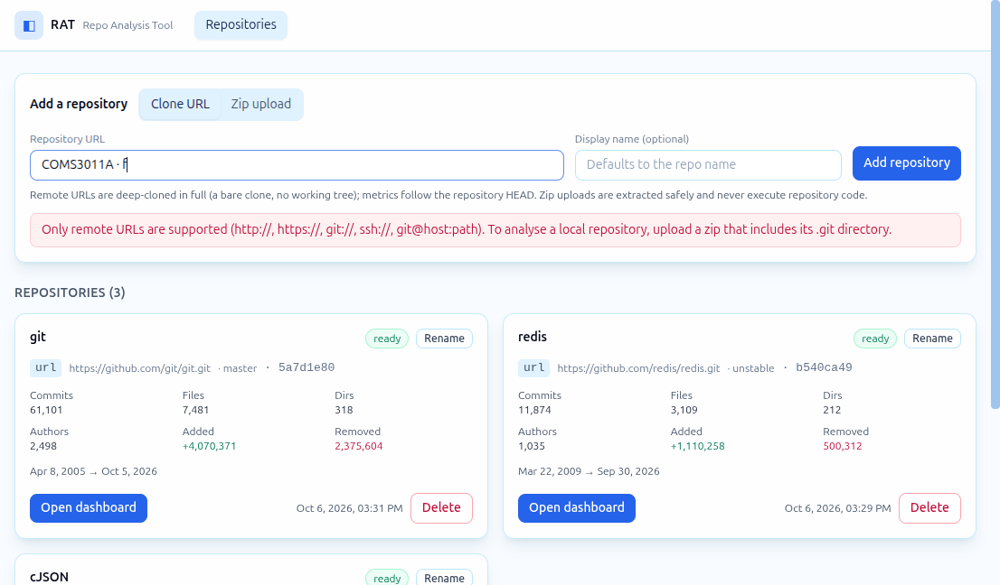
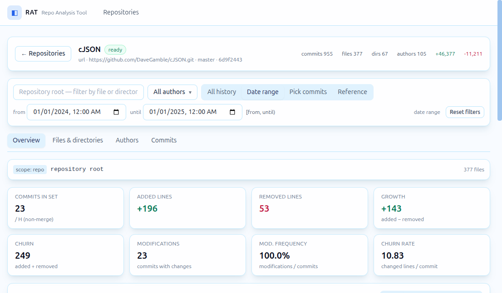
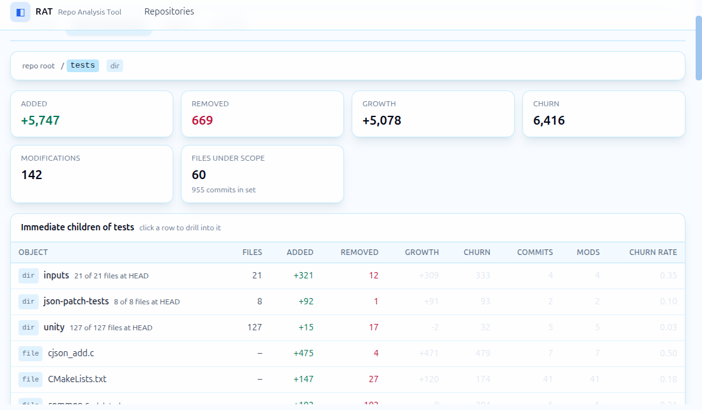
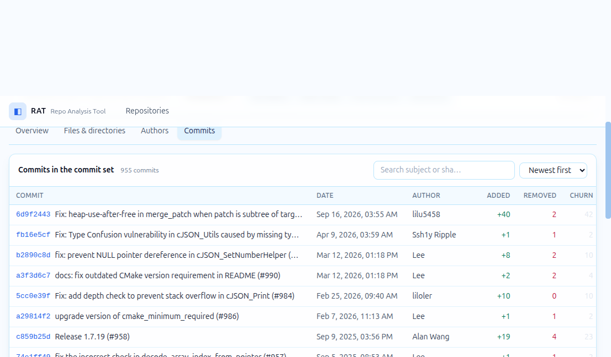

# RAT — Repository Analysis Tool

University of the Witwatersrand — COMS3011A test project.

RAT is a web dashboard for understanding how Git repositories evolve: which files
and directories churn, who contributed to each scope, and how metrics change over
custom commit sets.

## Table of Contents

- [Features](#features)
- [Screenshots](#screenshots)
- [Quick start](#quick-start)
  - [Local](#local-recommended)
  - [Docker](#docker)
- [Architecture](#architecture)
- [Metric mapping (spec → implementation)](#metric-mapping-spec--implementation)
- [Spec edge cases — how they are handled](#spec-edge-cases--how-they-are-handled)
- [API](#api)
- [CLI](#cli)
- [Benchmarks](#benchmarks)
- [Tests](#tests)
- [Project layout](#project-layout)
- [Notes](#notes)

## Features

- **Two ingestion modes** — deep clone of a remote URL, or a zip file containing the
  `.git` file/directory (extracted safely: no path traversal, zip-bomb guards).
- **Multiple repositories** — each with its own background ingestion job and progress.
- **Author merging** — automatic via `.mailmap` at parse time, plus manual merging,
  detaching and renaming in the Authors tab, with suggestions built from shared email
  addresses and near-identical names.
- **Filtering everywhere** — repository · author(s) · file or directory (with
  breadcrumb drill-down) · commit set: all history, date range, a manually picked
  commit list, or an arbitrary reference.
- **Five metric scopes** — file §2.1 · directory §2.2 · repository §2.3 · commit set
  §2.4 · author §2.5.
- **Commit explorer** — search, pagination, per-commit diff detail (renames shown as
  `old → new`, binary changes flagged).

## Screenshots

| | |
|---|---|
|  |  |
| Repositories page — add via URL or zip, cards summarise every ingested repo. | Overview tab with a date-range commit set (2024 window) and the spec §2.4 quantities. |
|  |  |
| Files & directories — per-file leaderboard with churn owners mini-bars. | Authors — suggested merges from shared emails / similar names, one click to merge. |

## Quick start

### Local (recommended)

Requirements: Python ≥ 3.11 and `git` on `PATH`. Node 20+ only if you want to rebuild
the UI (`frontend/dist` is committed, so plain Python is enough to run everything).

```bash
git clone <this-repo> && cd <this-repo>
make install        # pip install backend deps (+ npm install for the UI)
make run            # serves API + dashboard at http://127.0.0.1:8000
```

`make run` builds the dashboard first. If you skipped Node, then:

```bash
python -m pip install -r backend/requirements.txt
cd backend && python -m rat.cli serve --port 8000
```

| Command | What it does |
|---|---|
| `make run` | Build UI, serve API + dashboard on `:8000` |
| `make dev-api` | API with autoreload on `:8000` |
| `make dev-web` | Vite dev server on `:5173` (proxies `/api` to `:8000`) |
| `make demo` | CLI walkthrough of every metric category on cJSON |
| `make test` | Backend test suite (58 tests) |
| `make docker` | Build + run the whole app in a container |

### Docker

```bash
make docker         # docker compose up --build  ->  http://127.0.0.1:8000
```

The image is multi-stage (Node builds the dashboard, Python serves it), installs
`git`, stores all state in a named volume (`/data`), and has a healthcheck on
`/api/health`.

## Architecture

```
  zip / clone URL
        │
        ▼
 ┌─────────────────┐   one streaming pass    ┌──────────────────────┐
 │  ingest worker  │ ──────────────────────▶ │  SQLite (WAL mode)   │
 │  (job queue)    │   git log --numstat -z  │  commits · changes   │
 └─────────────────┘                         │  paths · authors …   │
                                             └──────────┬───────────┘
                                                        │ SQL aggregates
                                             ┌──────────▼───────────┐
                                             │ metric query layer   │
                                             │ scopes + commit sets │
                                             └──────────┬───────────┘
                                                        │ JSON
                                             ┌──────────▼───────────┐   ┌─────────────────┐
                                             │ FastAPI  /api/*      │◀─▶│ React SPA       │
                                             │ (serves frontend/dist)│   │ Vite + TS + TW  │
                                             └──────────────────────┘   └─────────────────┘
```

| Layer | Module | Responsibility |
|---|---|---|
| Ingest worker | `backend/rat/ingest.py` | SQLite-backed job queue; clone / zip extraction; one streaming pass into the tables; progress reporting; safe re-ingest |
| Git I/O | `backend/rat/gitio.py` | The single `git log` invocation, NUL-delimited record parser, clone, URL validation |
| Storage | `backend/rat/db.py` | Schema, WAL, per-request connections, covering index for path scopes |
| Metric query layer | `backend/rat/metrics.py` | Compiles scopes + commit sets into a handful of SQL aggregates (no per-object queries) |
| Author model | `backend/rat/authors.py` | mailmap identities vs. effective authors, manual merges/detaches/renames, merge suggestions |
| HTTP API | `backend/rat/api/` | FastAPI routers: repos, authors, metrics, commits, jobs |
| Dashboard | `frontend/src/` | React 18 + TypeScript + Tailwind + Recharts; filter state lives in the URL |

### Why the architecture scales

- **One git process per repository, not per commit.** Ingestion runs a single
  `git log --no-merges --root --use-mailmap -M50% --numstat -z` pass and streams the
  output straight into SQLite in batches. 61 k commits (git.git) index in ~77 s
  *including the clone*.
- **Disk-backed, single file.** SQLite in WAL mode comfortably holds the largest
  grader repo (git.git: 61 k commits / ~500 k file-change rows) and makes every
  query an indexed scan instead of an in-memory blowup.
- **Directory scopes are path ranges.** A scope `d` compiles to
  `d/ ≤ path < d0` — lexicographic neighbours of `/` — which rides the covering
  index `(repo_id, path, added, removed, sha)` and covers the whole subtree with one
  range scan. Directory roll-ups are therefore pure SQL sums, never in-memory walks.
- **Commit sets compile to one predicate.** `H̄` via a cached `ancestry` table
  (`git rev-list <ref>`, non-merge), `H_t` / `H_{i,j}` via `committer_date`
  comparisons, picked lists via an `IN` clause. Every metric endpoint reuses the
  same `commit_conditions()` + `scope_conditions()` builder, so all views agree by
  construction.
- **No N+1 anything.** The tree endpoint returns all immediate children of a
  directory (with rolled-up metrics) in one `GROUP BY`; ownership mini-bars use a
  window function; the commit list is one indexed page.

## Metric mapping (spec → implementation)

| Brief | Formula | Implementation |
|---|---|---|
| §2.1 File added / removed / growth / churn | `l⁺, l⁻, δ = l⁺−l⁻, λ = l⁺+l⁻` | `metrics.metrics_bundle()` — `SUM(added)`, `SUM(removed)` over `changes` rows for the path |
| §2.2 Directory metrics | recursive roll-up over immediate children | Same query shape with the path-range scope; `metrics.tree()` additionally aggregates per immediate child |
| §2.3 Repository metrics | directory metrics on the root | `scope = ''` (repo root) |
| §2.4 Commit-set sums | `l⁺_H,o`, `l⁻_H,o`, `δ_H,o`, `λ_H,o` | Same aggregates with the commit-set predicate applied |
| §2.4 Modifications | `n_H,o = Σ 𝕀n(h,o)` | `COUNT(DISTINCT sha)` with `added + removed > 0` |
| §2.4 Modification frequency | `η = n/|H|` | `mods / n_commits` (0 when `|H| = 0`) |
| §2.4 Churn rate | `ρ = λ/|H|` | `churn / n_commits` (0 when `|H| = 0`) |
| §2.5 Author modifications | `n_H,o,a` | `metrics.contributors()` — `GROUP BY author_id` with the same predicates |
| §2.5 Author churn | `λ_H,o,a` | Same grouping, `SUM(added + removed)` |
| §2.5 Ownership | `ω = λ_H,o,a / λ_H,o` | Churn share per author on the scope (0 when `λ_H,o = 0`) |

## Spec edge cases — how they are handled

- **Renames** — `--find-renames=50%` (the brief's threshold). A pure rename produces a
  change row with `0` added / `0` removed, so it is inert for every metric while still
  visible in the commit detail UI (`old → new`). A rename *plus* an edit is recorded
  under the **new path**, exactly as specified.
- **Deletions** — a deleted file is reported by git against its (now vanished) path;
  the row keeps that path, so the removed lines land on its path and `λ > 0` counts
  it as a modification of the commit.
- **Binary files** — git's own detection (`--numstat` prints `-`): stored with
  `is_binary = 1`, contribute `0` to every sum, flagged in the UI.
- **Initial commit** — `--root` diffs it against the empty tree, realising
  `h[p] = h∅`.
- **Merge commits** — `--no-merges` makes `H̄` exactly the non-merge commits reachable
  from the reference (default `HEAD`). Merges stay visible in the Commits tab but
  never contribute metrics.
- **Committer date** — `%ct` (unix seconds) is what `since`/`until` and the activity
  series bucket by, per the brief's `h[committer-date]`.
- **Author merging** — `.mailmap` is applied by git at parse time (`--use-mailmap`);
  the raw pre-mailmap identity is also stored per commit, so the Authors tab can show
  what was merged and suggest further merges. Manual merges/detaches are reversible
  single-row updates — metrics are never recomputed.

## API

All endpoints live under `/api`. Commit-set parameters are shared by `metrics`,
`series`, `contributors`, `files`, `tree` and `commits`:

| Parameter | Meaning |
|---|---|
| `ref` | Reference commit for `H̄` (default: repo `HEAD`; resolved via `rev-list`) |
| `since` / `until` | Committer-date bounds — unix seconds or ISO-8601 (inclusive / exclusive) |
| `commits` | Comma-separated sha list (manually picked commit set, ≤ 5000 shas) |
| `authors` | Comma-separated author ids, e.g. `1,4` (`authors` is the effective post-merge id) |

| Method & path | Purpose |
|---|---|
| `POST /api/repos/url` | Start ingestion from a remote URL → `202` + job |
| `POST /api/repos/zip` | Start ingestion from an uploaded zip → `202` + job |
| `GET /api/repos` · `GET /api/repos/{id}` | List / fetch repositories with summary stats |
| `PATCH /api/repos/{id}` · `DELETE /api/repos/{id}` | Rename / delete (rows + clones cleaned up) |
| `GET /api/repos/{id}/jobs` · `GET /api/jobs/{id}` | Ingestion job status / progress / errors |
| `GET /api/repos/{id}/metrics` | Spec §2.1–2.4 bundle for a scope + commit set |
| `GET /api/repos/{id}/series` | Activity series (added/removed/churn/commits) bucketed day/week/month |
| `GET /api/repos/{id}/contributors` | Spec §2.5 author table for a scope + commit set |
| `GET /api/repos/{id}/files` | Per-file aggregates, sortable, paginated, with owners |
| `GET /api/repos/{id}/tree` | Immediate children of a directory, rolled up |
| `GET /api/repos/{id}/paths` | Fuzzy path search for the scope picker |
| `GET /api/repos/{id}/commits` · `…/commits/{sha}` | Commit explorer (search, paging) / single-commit diff detail |
| `GET /api/repos/{id}/authors` · `…/authors/suggestions` | Identities + suggested merges |
| `POST /api/repos/{id}/authors/merge` | Merge identities into a target author |
| `POST /api/repos/{id}/authors/{id}/detach` · `PATCH …/{id}` | Undo a merge / rename an author |

## CLI

```bash
python -m rat.cli serve   [--host H] [--port P]      # API + dashboard
python -m rat.cli ingest  URL|PATH [--name NAME]     # synchronous ingest, prints JSON
python -m rat.cli repos                              # list ingested repositories
python -m rat.cli metrics REPO_ID [--path P] [--ref R]
                        [--since T] [--until T] [--commits S1,S2] [--authors 1,2]
```

`bash scripts/demo.sh` walks through the spec: ingest cJSON, then print repository,
directory, date-window, single-commit and author metrics.

## Benchmarks

Measured on the development machine (12-core Intel i3-1220P, SSD, Python 3.12,
SQLite WAL). Ingest time includes the clone/extraction. Query times are warm
`curl -w time_total` against the local server.

| Repository | Commits (H̄) | Files | Dirs | Authors | Ingest | Metric queries |
|---|---|---|---|---|---|---|
| cJSON | 955 | 377 | 67 | 105 | 2.3 s | 3–7 ms |
| Redis | 11,874 | 3,109 | 212 | 1,035 | 31.8 s | ≤ 75 ms |
| Git | 61,101 | 7,481 | 318 | 2,498 | 76.7 s | 6–457 ms |

Slowest git.git endpoints: `series` 457 ms, `files` 433 ms, `metrics` 209 ms
(directory scope: 47 ms), `contributors` 205 ms; all other endpoints ≤ 50 ms
(`commits` 6.5 ms, `authors` 15 ms, `paths` 3.6 ms). cJSON and Redis are
interactive-fast for every view.

## Tests

`make test` runs **58 tests** (pytest):

- `test_parser.py` — the streaming log parser against synthetic repositories:
  renames (pure / rename + edit), deletions, binary files, unicode paths, malformed
  records.
- `test_metrics.py` — metric-correctness: fixture repositories are built with real
  `git` commands and every spec quantity is asserted against independently computed
  expected values, including commit sets (date windows, picked commits, refs) and
  author merges.
- `test_api.py` — every HTTP endpoint through FastAPI's test client, including error
  paths (unknown repo/path/sha, bad timestamps, oversized commit lists).

## Project layout

```
backend/
  rat/
    api/          FastAPI routers (repos, authors, metrics, commits, jobs)
    authors.py    identities, manual merges, suggestions
    cli.py        serve / ingest / metrics / repos
    config.py     paths, env config, ingestion guards
    db.py         schema + connections (WAL)
    gitio.py      git log streaming parser, clone, validation
    ingest.py     job queue + indexing pipeline
    metrics.py    commit sets, scopes, aggregates, series, tree
  tests/          pytest suite + fixtures
frontend/
  src/
    api/          typed client for /api
    components/   FilterBar, CommitPicker, ui kit …
    pages/        Repositories, Dashboard
    state/        URL-driven filter state
    tabs/         Overview · Files & directories · Authors · Commits
scripts/demo.sh   end-to-end CLI demo
Dockerfile · docker-compose.yml · Makefile
docs/             screenshot assets
```

## Notes

- The commit picker sends at most 5,000 shas per request (URL-length guard); the UI
  enforces the same cap.
- A file that exists in the commit set but was not changed inside it appears in
  directory listings with zero metrics (it is part of `H[F]`); file leaderboards list
  objects with at least one recorded change event.
- The activity chart buckets automatically (`auto` → day/week/month) so large
  histories stay responsive.
